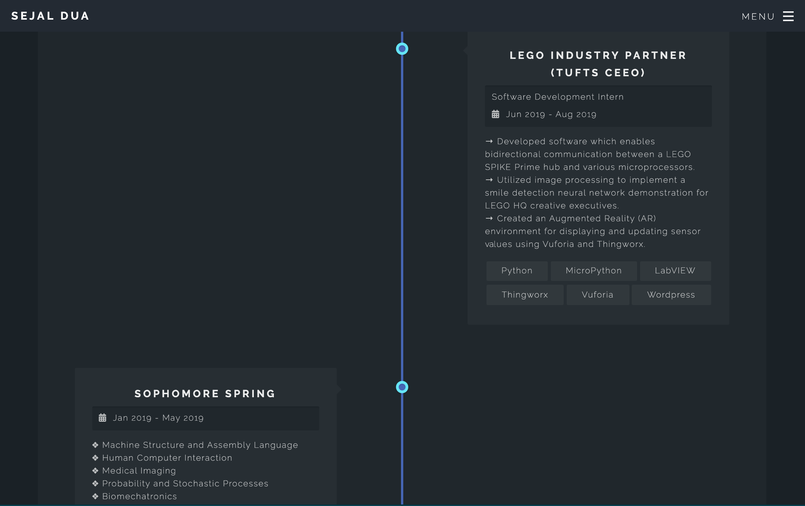
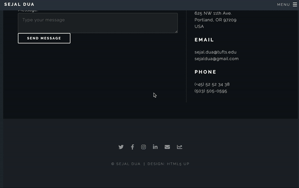

My personal website! This project represents my first experience coding in
HTML and CSS. I am using my own Google domain and plan on updating the site
as I work on more projects that I will be adding to my portfolio.

### ⚡ Fun New Features ⚡

1. The timeline page of my academic journey till now (check it out! suggestion: best enjoyed on full-screen on a computer but mobile-friendly)


2. Wrote some Javascript so that the header image of both html pages changes depending on the day of the month (NOTE: this requires having 31 cover / banner photos and having a consistent, sequential naming convention for those photos)

Here is the code for that:
```Javascript
<script src="http://code.jquery.com/jquery-1.11.0.min.js"></script>
<script>
$(document).ready(function(){
	var header = $('body');
	var d = new Date();
	var n = d.getDate();
	var str1 = 'url("images/banner';
	var str2 = '.JPG")';
	var background = str1.concat(n, str2);
	var current = 0;
	header.css('background-image', background);
	header.css('background-size', 'cover');
});
</script>
```
4. discovered  which gives you a bunch of insights into what type of developer you are (e.g. which languages you are most preficient in, when you are most active / productive, which libraries you have used, coding conventions you prefer, etc.). this is the link to my profile: https://sourcerer.io/sejaldua. you can access it on my website by navigating to the footer and clicking on the statistics icon:



### Tracking Hits


<!-- | Page | Count |
|-----|-----|
| Home |  |
| Projects |  |
| Timeline |   |
| Articles |   |
| Links |   |
| Bucket List |   | -->

### CREDITS

* Spectral by HTML5 UP
* Unsplash (unsplash.com)
* Font Awesome (fontawesome.io)
* jQuery (jquery.com)
* Scrollex (github.com/ajlkn/jquery.scrollex)
* Responsive Tools (github.com/ajlkn/responsive-tools)
* HELP → w3 (https://www.w3schools.com/)
